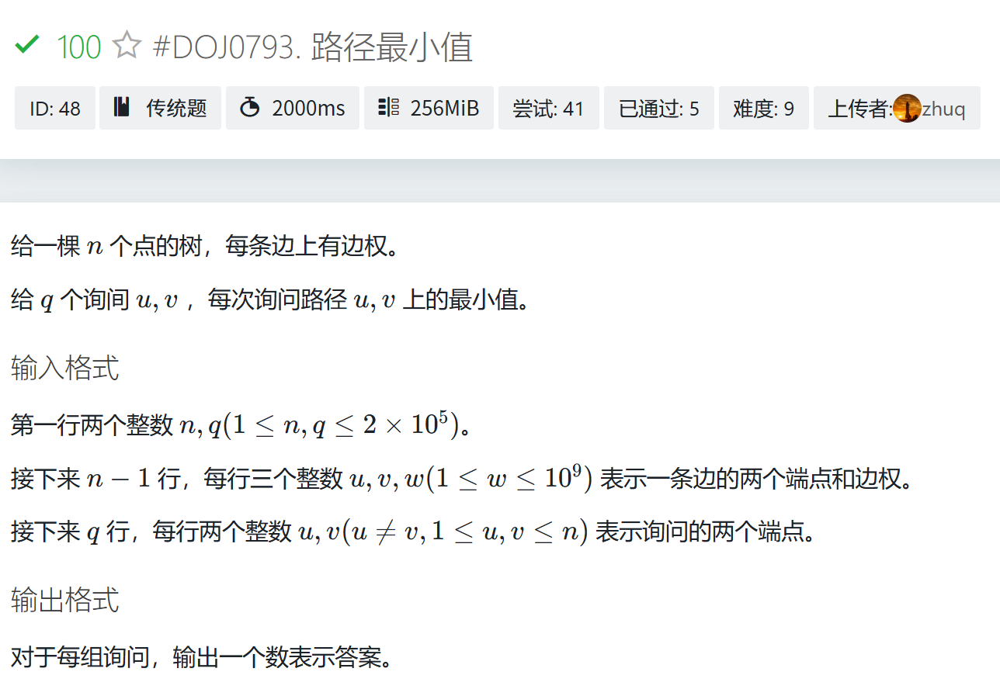
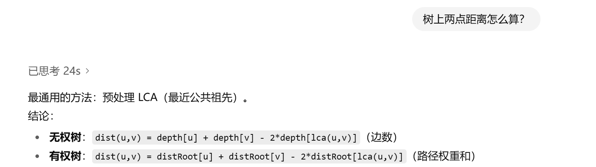
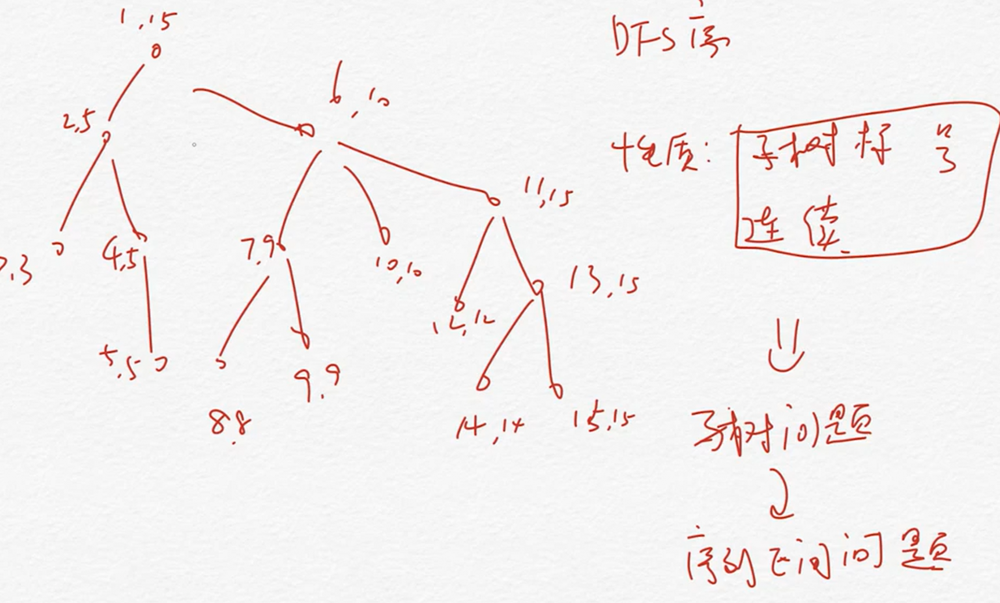
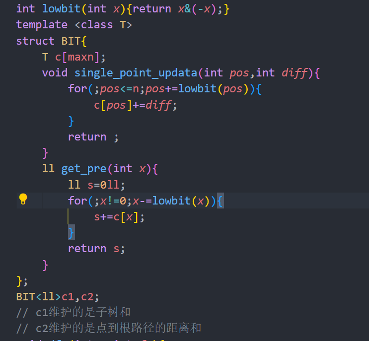

# 倍增 DFS序 欧拉序

## 对于倍增来说，常用的有ST表可以求LCA，后者的时候可以静态的记录一些信息，比如路径最小值。

- https://hydro.ac/d/jouxcpcteam/p/DOJ0793
- tips:不同的根建成的树（即改变树的根节点）会影响 LCA 的查询结果，但不会改变两个节点之间的路径本身的节点集合
  

## LCA变种问题 求树上两点距离

- HDU2586
  

## DFS序 作用是把子树问题转化成连续的区间序列问题

- 在你维护多个东西的时候 最好考虑封装 不然太难搞了
